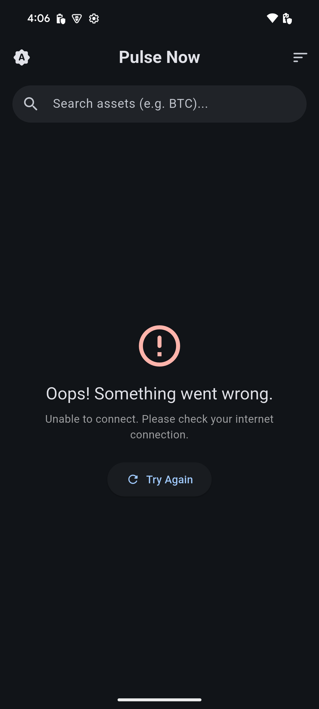
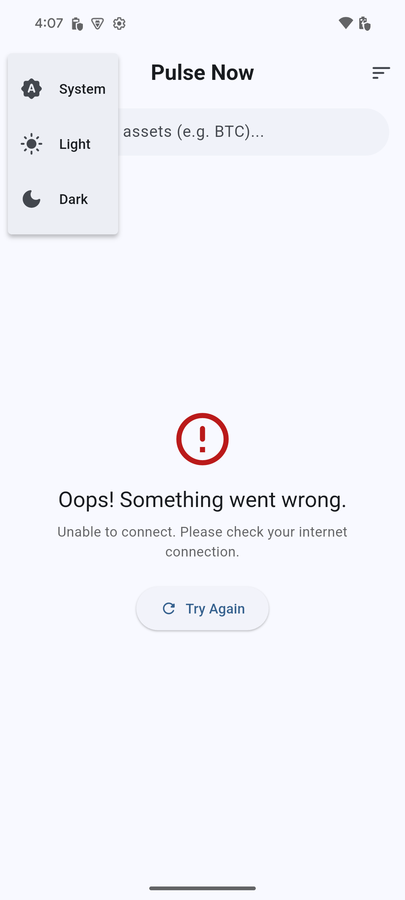
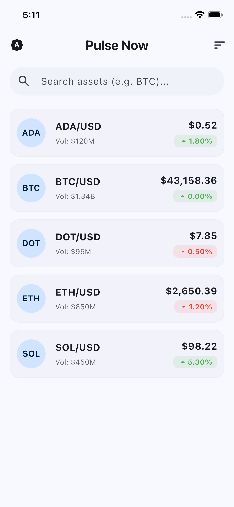
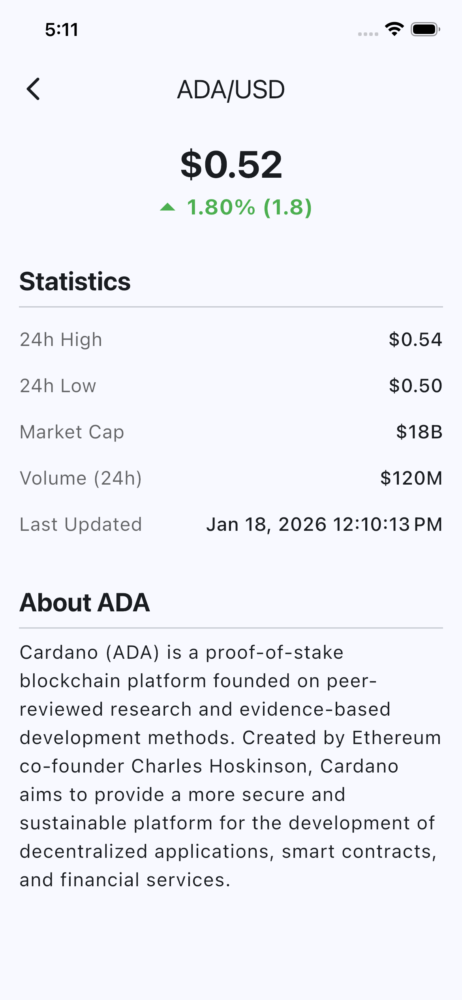
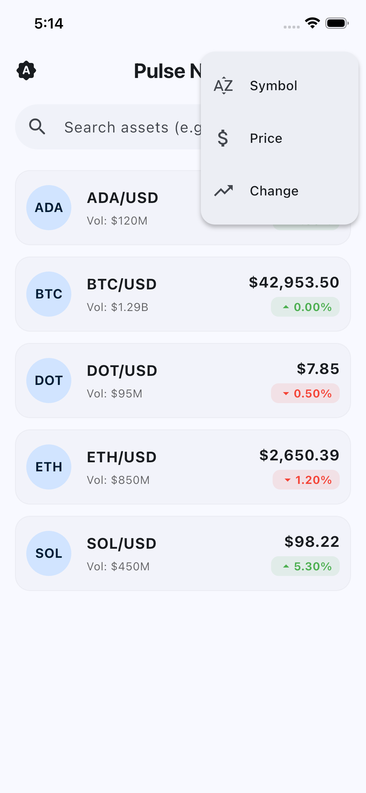
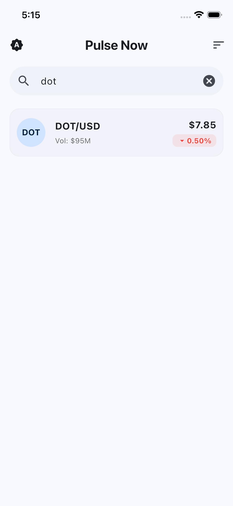
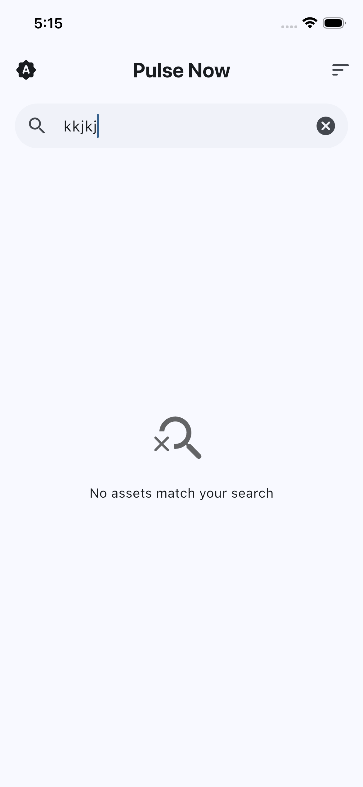

# PulseNow Flutter Assessment

This is the Flutter application for the PulseNow assessment. Your task is to implement the missing
functionality to create a fully functional crypto trading and analytics mobile app.

## Project Screenshots

### App Gallery

|                                                      |                                                      |                                                      |
|:----------------------------------------------------:|:----------------------------------------------------:|:----------------------------------------------------:|
| <br>Preview 01 | <br>Preview 02 | <br>Preview 03 |
| <br>Preview 04 | <br>Preview 05 | <br>Preview 06 |
| <br>Preview 07 |                                                      |                                                      |

## Setup

1. Ensure Flutter is installed (Flutter 3.0+)
2. Install dependencies:

```bash
flutter pub get
```

3. Make sure the backend server is running (see `../backend/README.md`)

4. Run the app:

```bash
flutter run
```

## Project Structure

```
lib/
├── main.dart                 # App entry point
├── models/                   # Data models
├── services/                 # API, WebSocket, and Cache services
├── providers/                # State management (MarketData, Theme, Analytics)
└── screens/                  # UI screens (Home, MarketData, Detail)
```

## Implemented Features

- **Real-time Market Updates**: Integrated WebSockets for live price movements.
- **Advanced UI**: Animated list transitions, Hero animations, and Material 3 design.
- **Search & Filtering**: Real-time asset filtering with input validation.
- **Sorting**: Multi-criteria sorting (Symbol, Price, Change).
- **Dark Mode**: Support for Light, Dark, and System theme switching.
- **Offline Support**: Local caching for immediate data access without internet.
- **Error Recovery**: Robust error handling with retry mechanisms and timeouts.

## Assessment Requirements

See `ASSESSMENT.md` for detailed requirements.
